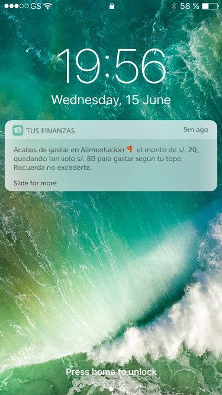

# Aplicación financiera Tus Finanzas - Resideño

## Objetivos Iniciales

* Identificar cuales son las posibles causas del rebote en el landing page.
* Identificar los problemas que posee actualmente la app.
* Realizar una propuesta de rediseño de app con un flujo mucho más amigable para el usuario.

### Problemas encontrados a nivel de negocio 

#### Conclusiones de la data

Se nos proporcionó una data de la aplicación de los primero 6 meses desde el lanzamiento de la aplicación Tus finanzas el cual pasamos a analizar para tener un mayor entendimiento del negocio como determinar posibles problemas. Las conclusiones de la data se pueden visualizar en [esta](https://docs.google.com/presentation/d/1Z7585VzphH2l1c1yBimRueJYj4Xl-_PyPUh6WX7KRwQ/edit?usp=sharing) presentación.

#### Testing de la aplicación actual a rediseñar

Se realizó testing a 6 usuarios del actual prototipo encontramos los siguientes problemas:

1. En el landing page no visualiza la disponibilidad para el dispositivo (actualmente solo para IOS).
2. La mayor cantidad de personas que ingresan al landing page son usuarios de android.
3. El formulario para enviar el link de descarga, es algo incomodo para los usuarios.
4. La cantidad de impresiones de facebook difiere demasiado a las vistas al landing page.

### Problemas encontrados a nivel de usuario

1. Existe confusión en la vista de ahorros, realizar una meta de ahorro está escrito como “Crear cuenta”
2. El usuario no escoge la periodicidad de su cuota de ahorro, y solo ve la frecuencia y el monto a ahorrar casi al finalizar “crear cuenta”, esto le ocasiona incomodidad.
3. La mayoría de usuarios testeados y entrevistados reciben su sueldo en su respectiva tarjeta, las cuales utilizan para realizar compras en establecimientos con este medio de pago, sin embargo existe un gran porcentaje de usuarios que retiran su dinero y no llevan el control de sus gastos o les parece pesado detallar cada gasto de manera manual. Ellos suelen analizar los gastos del mes actual y ponerles como un tope para el próximo mes poder no sobrepasar este monto y ahorrar.

## Planeamiento y presupuesto
Hemos trabajado en base a un presupuesto de 330 puntos, para ver el sustento y detalle, hacer click [aquí](https://docs.google.com/spreadsheets/d/1iTTE4I9BoogeJpxasQy6_O3esUpVbxuLFGqa4HDFR6U/edit)

### Benchmark

### Testing

Antes de realizar las entrevistas con los usuarios decidimos realizar testing de la actual aplicación a 6 usuarios para identificar los diferentes problemas y dificultades que podría estar presentando la aplicación para los usuarios. [Aquí](https://drive.google.com/drive/folders/1tX4PPUeOUeuWNRhZAqV5d19Zht0OU53D?usp=sharing), podrás visualizar la guía de testing en donde también se encuentran las conclusiones, los videos y audios realizados. Finalmente, se realizó un [affinity map](https://realtimeboard.com/app/board/o9J_kzenrq8=/) sobre las conclusiones de los testing. 

### Entrevistas

Realizamos 5 entrevistas, entre ellas una pareja de esposos, puedes consultar la guía de preguntas elaboradas a usuarios [aquí](https://drive.google.com/drive/folders/1qaPnOur8W1crgtfNnjKHyNUSoNZ3Ajzp), en donde también encontrarás las conclusiones, los videos y audios realizados. Finalmente, se realizó un [affinity map](https://realtimeboard.com/app/board/o9J_kzepe7g=/) sobre las conclusiones de las entrevistas. 

### User Persona

## Recomendaciones:
* Invertir para mejorar la publicidad de impresiones en facebook porque solo el 2.39% por esta aplicación entra al landing page.
* Mejorar perfil en app store. De los que visitan el app store, solo el 12.82% descarga la aplicación. 
* Mejorar el landing page, solo el 12.35% de los que visitan el landing pages visitan el app store.
* Diseñar y desarrollar la aplicación para android, ya que existe gran parte de visitantes que poseen dispositivos con este sistema operativo.
* Por los resultados brindados en los testeos y entrevistas proponemos la Modificación del diseño y desarrollo de la app para un nuevo flujo de las funcionalidades en  “Gastos y ahorros”.

## Propuestas:

### Landing page: 

* Indicar que la aplicación es para IOS.

* El botón de descarga debe mandar directo al App store y retirar formulario de descarga.

### Registro: 

* Eliminar opción de foto de perfil.
 

### Gastos: 

* Visualizar total de gastos.
* Opción dividir y personalizar retiro efectivo.
* Categorías de gastos: Servicios, alimentos, transporte, otros etc.
* Opción de agregar tope a cada categoría de gasto.
* Opción a agregar categoría de gasto.
* Gráficos sobre tus gastos.

### Ahorros: 

* Cambiar nombre de opción “crear cuenta” a “crear meta”.
* Opción crear meta: El usuario puede seleccionar periodicidad a ahorrar: diario, semanal, mensual, quincenal. La aplicación calcular cuánto demorarán en ahorrar según los datos proporcionados antes de confirmar la meta de ahorro.
* Gráficos sobre tus ahorros.

### Notificaciones:

* La aplicación notificará al usuario cuando este esté cerca a llegar al tope de gasto que él mismo se puso. Esto ayudará al usuario a medirse en cuanto a determinados gastos.

* La aplicación notificará al usuario cada vez que la aplicación automáticamente pase el monto de ahorro desde su saldo a la meta de ahorro.

## Prototyping
 
### 1. Sketch
Iniciamos realizando un prototipo de baja fidelidad en donde plasmamos diversas ideas para el flujo de "gastos y ahorros" deacuerdo a las conclusiones de testing del prototipo interactivo inicial y de las entrevistas a usuarios.

### 2. Prototipo de Alta Fidelidad

Puedes ver el prototipo de alta fidelidad que realizamos en Figma [aquí](https://www.figma.com/file/cx9Bb3rkGkGoo130qJ8nor/proyecto-Tus-Finanzas-App-redise%C3%B1o?node-id=0%3A1)

### 3. Prototipo Interactivo

El protitpo interactivo lo realizamos en marvel, puedes dar click a [Tus finanzas app](https://marvelapp.com/5j3hbj9/screen/48644047) para poder visualizarlo.

### 4. Otras de nuestras propuestas

Realizando los testing y entrevista nos dimos cuenta que el usuario esperaba avisos, recordatorios o notificaciones tanto a nivel de ahorro como en gastos, es por ellos que proponemos las notificaciones avisando el ahorro automático y los recordatorios del tope de gasto de la categoría que eligan.

Ahora para fomentar más el ahorro proponemos que el usuario gane intereses cada mes y que este mismo tenga la opción de escoger a que meta de ahorro desea que le abonen el interés ganado.

Por último, se generó un nuevo [Userflow](https://userflows.marvelapp.com/5j3hbj9) .

### 5. Diseño para desarrolladores

[Link de zeplin](https://zpl.io/VQE3Qjk)

### 6. Presentación de demo

Se realizó una presentación de 5 minutos en [loom](https://www.useloom.com/share/657cc36489e5499b869c3d48a614ec4e) explicando el desarrollo del proyecto; así como también mostramos el demo de la solución propuesta.

### 7. Hacker edition

Realizamos el primer punto del hacker edition el cuál se puede visualizar [aquí](https://docs.google.com/document/d/1BaNfF4g5cqwvpfZMfraOqA98dCQhruOGrk_Mo88YTrs/edit?usp=sharing).

